<center><h1>PRD-食疗养生小程序</h1></center>

[TOC]

# 一、文档综述

## 1.版本修订记录

v0.1 创建文档

v0.2 修改文档，不强制要求进入就要授权（小程序不允许这样做）。

## 2.产品介绍


# 二、产品分析

## 2.1.用户需求分析

随着手机在老年人中的普及，以及老年人越来越关注个人健康，一款帮助老年人的app越来越重要。

## 2.2. 用户定位

会使用手机微信的老年人


# 三、产品结构

## 3.1 产品功能结构图




## 3.2 产品信息结构图



# 四、全面说明

## 4.1 功能权限
(1)分为未登录状态和登录状态，打开小程序如果检测未登录自动跳转到登录页面。只能采用微信授权登录方式登录。
(2)登录状态下可以进行小程序呢所有操作。


## 4.2 键盘说明
(1)点击搜索框，用户名输入框，用户疾病史输入框，用户评论框时弹出字母全键盘
(2)点击填写用户年龄时弹出数字键盘

## 4.3 页面交互说明

(1)更新信息


(2)

## 4.4 前后端调用说明

前后端交互都默认采用GET/POST请求，请求或相应body为json格式，文件格式除外


# 五、页面逻辑


# 六、页面详细功能说明

## 6.1 登录页

（1）登录页面

当进入到小程序后，首先会判断是否登录，如果没有登录则会弹出登录窗口。~~登录成功跳转到主页（食物种类页）。~~登录成不成功均谈到主页窗口

(2)登录页逻辑流程

```flow
st=>start: 进入小程序
op1=>operation: 获取用户授权登录
cond1=>condition: 用户是否授权
op2=>operation: 跳转到食物种类页
op3=>operation: 退出小程序
e=>end: 结束
st->op1->cond1
cond1(yes)->op2
cond1(no)->op2
op2->e

```


(3)调用后端接口：

POST /DietRegimen/client/user/userLogin

Request Body:{

​	code                      登录凭证

​	userInfo                  AppID

​	secret             

​	grant_type

}

Resonse Body:{

body:{

​		code              返回码

​		sessionID 

}

[注]此处可参考小程序的登录API

### 


## 6.2 食物种类页

（1）食物种类页面

a.页面介绍：

- 该页面为食谱的主页。

- 默认显示食物种类,包含种类图片，种类名称，种类介绍。
- 页面有搜索按钮，可以按关键词/食物种类/疾病搜索食物。

  

b.页面入口：

- 点击小程序的食谱tab按钮

- 从食物清单页面返回
- 从食物详细信息页面返回。

c.页面交互说明：

- 用户点击某一食物种类，页面跳转到食物清单页面，显示对应食物种类的食物。
- 用户点击搜索按钮，输入搜索词，页面跳转到食物清单页面，显示与搜索词相关的食物。如果点击取消搜索，页面不跳转。

（2）食物种类页逻辑流程


```flow
st=>start: 进入页面
op1=>operation: 显示食物种类
op2=>operation: 跳转到食物界面
op3=>operation: 输入关键词
cond1=>condition: 是否点击某食物种类
cond2=>condition: 是否点击搜索按钮
cond3=>condition: 是否点击确认搜索
e=>end: 结束

st->op1->cond1
cond1(yes,right)->op2
cond1(no,left)->cond2
cond2(no)->op1
cond2(yes)->op3
op3->cond3
cond3(yes)->op2
cond3(no)->op1
op2->e
```

（3）调用后端接口：

a.获取食物种类

- GET /DietRegimen/client/food/getFoodCategory

- return:

  body:{

  ​	code:               返回代码

  ​	foodCategory :{}  食物种类列表

  }

b.搜索食物清单/获取指定食物种类的食物清单

- POST /DietRegimen/client/food/searchFood

  body:{

  ​		keywords:              关键词

  }

- return:

  body:{

  ​		code:                    返回代码

  ​		foods:{}                食物集合

  }

  

  

## 6.3 食物清单页

(1)食物清单页面

a.页面介绍：

- 页面显示食物清单。
- 页面有搜索按钮，可搜索当前食物清单下的食物（此处只涉及前端不涉及后端）。
- 食物清单有滚动条，每个食物显示食物名称，食物种类，食物图片，食物关键词。

b.页面入口：

- 在食物种类页面点击某一食物种类.
- 在食物种类页面点击搜索按钮后并点击确定搜索。
- 从食物详细信息页返回
- 从智能推荐页面进入

c.页面交互说明：

- 用户点击某一食物，跳转到食物详细信息页面。
- 用户点击搜索，食物清单更新，更新的食物清单是最原始食物清单的子集。

d.前置条件

- 页面初始化时必须接收食物清单，否则食物清单列表显示空

(2)食物清单页逻辑流程


```flow
st=>start: 进入食物清单页
op1=>operation: 显示食物清单信息
op3=>operation: 输入关键词
cond1=>condition: 是否点击某食物
cond2=>condition: 是否点击搜索
cond3=>condition: 是否点击确认搜索
op2=>operation: 跳转到食物详细信息页
op4=>operation: 更新食物列表
e=>end: 结束

cond4=>condition: 是否点击收藏按钮
op5=>operation: 收藏食物


st->op1->cond2
cond2(yes)->op3->cond3
cond2(no)->cond1
cond3(yes)->op4->e
cond3(no)->cond1
cond1(yes)->op2->e
cond1(no)->cond4
cond4(yes)->op5->e
cond4(no)->e

```


(3)调用后端接口

a.获取食物详细信息

- POST /DietRegimen/client/food/getFoodDetails

  body:{

  ​		foodID           食物id

  }

- retun:

  body:{

  ​		code:                  返回代码

  ​		details:                 食物详细信息

  }

- 

##6.4 食物详细信息页


(1)食物详细信息页面

a.页面介绍

- 页面显示食物详细信息，包括食物名字，食物所属种类，食物关键词，食物介绍，食物功效，食物禁忌，用户评论信息，食物图片，用户评论信息。
- 页面有语音播报功能，点击后可以播放该食物相关信息。
- 页面有返回按钮，可以返回食物清单/收藏页面。
- 页面有评论按钮，用户可在该页面进行评论。
- 页面有收藏按钮，用户点击搜查按钮可将食物加入收藏

b.页面入口

- 页面入口为在食物清单页面点击某食物，
- 从收藏食物处点击收藏食物进入（此处返回是返回到收藏界面）。

c.页面交互说明

- 点击语音播报功能，会播放语音，播放食物相关信息

- 用户点击评论按钮，输入评论内容，点击确认评论，页面刷新，显示最新评论。

d.前置条件

- 获取某食物的foodID
- 页面初始化时必须接受食物详细信息

(2)食物详细信息逻辑流程

```flow
st=>start: 进入页面
op1=>operation: 显示食物详细信息
cond4=>condition: 是否点击返回按钮
op7=>operation: 返回食物清单/收藏页面
e=>end: 结束
st->op1->cond4
cond4(yes)->op7->e
cond4(no)->e

```


```flow
st=>start: 进入页面
op1=>operation: 显示食物详细信息
cond1=>condition: 是否点击评论按钮
cond2=>condition: 是否点击提交评论按钮
cond3=>condition: 是否点击语音播报按钮
op4=>operation: 播放语音信息
op5=>operation: 填写评论
op6=>operation: 刷新页面
op8=>operation: 跳转到登录页面
cond6=>condition: 是否登录 
cond5=>condition: 是否登录 
e=>end: 结束
st->op1->cond1
cond1(yes)->cond5
cond5(yes)->op5->cond2
cond5(no)->op8->e
cond1(no)->cond3
cond2(yes)->op6->e
cond2(no)->e
cond3(no)->e
cond3(yes)->cond6
cond6(yes)->op4->e
cond6(no)->op8->e
cond5(no)->op8->e

```

st=>start: 进入页面
op1=>operation: 显示食物详细信息
cond1=>condition: 是否点击评论按钮
cond2=>condition: 是否点击提交评论按钮
cond3=>condition: 是否点击语音播报按钮
op4=>operation: 播放语音信息
op5=>operation: 填写评论
cond4=>condition: 是否点击返回按钮
op6=>operation: 刷新页面
op7=>operation: 返回食物清单/收藏页面
op8=>operation: 跳转到登录页面

cond5=>condition: 是否登录 
e=>end: 结束
st->op1->cond4
cond4(yes)->op7->e
cond4(no)->cond5
cond5(no,left)->op8->e
cond5(yes)->cond1

cond1(yes)->op5->cond2
cond1(no)->cond3
cond2(yes)->op6->e
cond2(no)->e

cond3(yes)->op4->e
cond3(no)->e

(3)调用后端接口

a.发表评论

- POST  /DietRegimen/client/food/commentFood

  body:{

  ​	token                 用户token

  ​	foodID               食物id

     content               评论内容

  }

- return:

  body:{

  ​		code         返回代码

  }

b.获取语音播报

- POST  /DietRegimen/client/food/foodVoice

  body:{

  ​	token         用户token

  ​	foodID       食物id

  }

- return:

  foodVoice.mp3     语音文件

通过http返回状态码判获取断成功与失败。

c.获取食物详细信息

- POST /DietRegimen/client/food/getFoodDetails

  body:{

  ​		foodID           食物id

  }

- retun:

  body:{

  ​		code:                  返回代码

  ​		details:                 食物详细信息

  }

d.收藏食物

- POST  /DietRegimen/client/user/collectFood

  body:{

  ​	token              用户token

     foodID             食物id

  }

- return

  body:{

  ​	code                  返回码

  }


## 6.5 疾病清单页

(1)疾病清单页面

a.页面介绍

- 该页面显示所有疾病，
- 该页面为疾病的主页。
- 页面有搜索按钮。
- 疾病清单有滚动条，每个疾病显示疾病名称，疾病分类，疾病信息前面20字

b.页面入口

- 点击小程序的疾病tab
- 从疾病详细信息页返回

c.页面交互

- 点击指定疾病，跳转到疾病详细信息页
- 点击搜索按钮，输入关键字后出现与关键词有关的疾病

(2)疾病清单页逻辑流程

```flow
st=>start: 进入疾病清单页
op1=>operation: 显示疾病清单
cond1=>condition: 是否点击搜索按钮
op2=>operation: 输入搜索信息
cond2=>condition: 是否点击确认输入按钮
op3=>operation: 刷新页面
cond4=>condition: 是否点击某疾病
op4=>operation: 跳转到疾病详细信息页面
e=>end: 结束

st->op1->cond1
cond1(yes)->op2
op2->cond2
cond2(yes)->op3
op3->e
cond1(no)->cond4
cond4(yes)->op4->e
cond4(no)->e

```


(3)调用后端接口

a.获取疾病清单

- GET /DietRegimen/client/health/getDiseasesLists

- return:{

  ​		code          返回代码

  ​		diseases:{}      疾病清单

  }

b.获取疾病详细信息

- POST /DietRegimen/client/health/getDiseaseDetails

body:{

​	diseaseID  疾病id

}

- return:

  body:{

  ​	code   返回代码

  ​	diseaseDetails     疾病详细信息

  }

## 6.6 疾病详细信息页


(1)疾病详细信息页面

a.页面介绍

- 页面显示疾病详细信息，包括疾病名称，疾病分类，用户评论信息，疾病信息，推荐食物。
- 推荐食物也做为一个button，点击后跳转到食物清单页面。
- 页面有评论按钮，用户可以发表评论。
- 页面有收藏按钮，用户点击收藏按钮，可以将疾病加入收藏。

b.页面入口

- 从疾病清单点击某一疾病进入。
- 从收藏疾病除点击某疾病进入。（此处返回是返回到收藏界面）

c.页面交互

- 用户点击评论按钮，输入评论内容，点击确认评论，页面刷新，显示最新评论。
- 用户点击返回按钮，返回到疾病清单页面或收藏页面。
- 用户点击收藏按钮，将疾病加入用户个人收藏。

(2)疾病详细信息页逻辑流程

```flow
st=>start: 进入疾病详细信息页
op1=>operation: 显示疾病详细信息
cond1=>condition: 是否点击评论
op2=>operation: 输入评论信息
cond2=>condition: 是否点击确认评论
op3=>operation: 刷新页面
cond4=>condition: 是否点击语音播报按钮
op4=>operation: 语音播报

cond3=>condition: 是否点击返回按钮
op5=>operation: 返回疾病清单/收藏页

cond5=>condition: 是否点击收藏按钮
op6=>operation: 收藏疾病

cond6=>condition: 是否点击推荐食物
op7=>operation: 跳转到食物清单页

e=>end: 结束
st->op1->cond1
cond1(yes)->op2->cond2
cond2(yes)->op3->e
cond2(no)->cond4
cond1(no)->cond4
cond4(yes)->op4->e
cond4(no)->cond3
cond3(yes)->op5->e
cond3(no)->cond5
cond5(yes)->op6->e
cond5(no)->cond6
cond6(yes)->op7->e
cond6(no)->e

```


(3)调用后端接口

a.发表评论

- POST  /DietRegimen/client/health/commentDisease

  body:{

  ​	token                 用户token

  ​	diseaseID           食物id

  ​    content              评论内容

  }

- return:

  body:{

  ​		code         返回代码

  }

b.获取语音播报

- POST  /DietRegimen/client/health/diseaseVoice

  body:{

  ​	token             用户token

  ​	diseaseID       疾病id

  }

- return:

  diseaseVoice.mp3     语音文件

通过http返回状态码判获取断成功与失败。

c.收藏疾病

- POST  /DietRegimen/client/user/collecDisease

  body:{

  ​	token                  用户token

     diseaseID            疾病id

  }

- return

  body:{

  ​	code                  返回码

  }

## 6.7 智能推荐页面

(1)智能推荐页面

a.页面介绍

- 页面显示推荐信息。包括推荐食物，推荐信息。
- 页面有填写问卷按钮。
- 推荐食物也是一个button.
- TODO:others

b.页面入口

- 从问卷填写页面进入
- 从推荐tab中进入，且没有填写过问卷

c.页面交互

- 点击填写问卷按钮，跳转到问卷填写页面。
- 点击推荐食物按钮，跳转到食物清单页面。

(2)智能推荐页页逻辑流程

进入：

```flow
st1=>start: 点击推荐tab
cond1=>condition: 是否填写过问卷
op1=>operation: 进入智能推荐页面
op2=>operation: 进入问卷填写页面
e=>end: 结束
st1->cond1
cond1(yes)->op1->e
cond1(no)->op2->e
```

详细逻辑：

```flow
st1=>start: 进入智能推荐页面
op1=>operation: 显示智能推荐信息
cond1=>condition: 是否点击填写问卷按钮。
op2=>operation: 跳转到问卷填写页面
cond2=>condition: 是否点击推荐食物按钮
op3=>operation: 跳转到食物清单页
e=>end: 结束

st1->op1->cond1
cond1(yes)->op2->e
cond1(no)->cond2
cond2(yes)->op3->e
cond2(no)->e
```


(3)调用后端接口

a.获取推荐信息 

- POST /DietRegimen/client/recommend/getRecInfo

  body:{

​			token           用户token

   }

- return

  body:{

  ​		code               返回码

  ​		info:{}             推荐信息

  ​		foods:{}          食物清单

  }

## 6.8 问卷填写页面

(1)问卷填写页面

a.页面介绍

- 页面全部为选择题。
- 页面有提交按钮。

b.页面入口

- 从推荐tab中进入，且没填写过问卷。
- 从智能推荐页面进入问卷填写页面。

c.页面交互

- 用户在页面做选择题 ，最后点击submit按钮提交，进入到智能推荐页面。

(2)问卷填写页逻辑流程

```flow
st1=>start: 进入问卷填写页
op1=>operation: 显示问卷
op2=>operation: 问卷填写
cond1=>condition: 是否点击提交按钮
op3=>operation: 跳转到智能推荐页面
e=>end: 结束
st1->op1->op2->cond1
cond1(yes)->op3->e
cond1(no)->op1
```


(3)调用后端接口

a.获取问卷信息

GET  /DietRegimen/client/recommend/getQuestionnaireInfo

- return

  body:{

  ​	code          返回码

  ​    infoLists     问卷列表     

  }

b.提交问卷

- POST  /DietRegimen/client/recommend/submitQuestionnaire

  body:{

  ​	token                      用户token

  ​	answerInfoLists      问卷回答信息

  }

- return

  body:{

  ​		code       返回码

  }


## 6.9 个人信息页

(1)个人信息页面

a.页面介绍

- 个人信息页面，包括年龄，性别，疾病史，用户头像。
- 页面有设置个人信息按钮
- 页面有收藏按钮

b.页面入口

- 从我的tab标签进入
- 从用户信息页面返回
- 从用户收藏信息页面返回

c.页面交互

- 点击设置用户个人信息按钮，跳转到个人信息设置页面
- 点击收藏按钮，跳转到收藏页面。

(2)个人信息页逻辑流程

```flow
st=>start: 进入个人信息页
op1=>operation: 显示用户个人信息
cond1=>condition: 是否点击设置个人信息按钮
cond2=>condition: 是否点击收藏按钮
op2=>operation: 前往个人信息页
op3=>operation: 前往收藏页
e=>end: 结束
st->op1->cond1
cond1(yes)->op2->e
cond1(no)->cond2
cond2(yes)->op3->e
cond2(no)->e
```


(3)调用后端接口 

a.获取个人信息

- POST  /DietRegimen/client/user/getUsertInfo

  body:{

  ​	token                      用户token

  }

- return

  body:{

  ​		code              返回码

  ​		userInfo:{}         用户详细信息

  }

b.获取收藏信息

- POST  /DietRegimen/client/user/getCollectInfo

  body:{

  ​	token                      用户token

  }

- return

  body:{

  ​	code                  返回码

  ​    collectInfo:{}      收藏信息，包含疾病和食物信息

  }

## 6.10 个人信息设置页

(1)个人信息设置页面

a.页面介绍

- 此处可以填写或者修改个人信息，包括用户名称，性别，年龄，疾病史
- 页面包含提交按钮。

b.页面入口

- 从个人信息页面进入

c.页面交互

- 用户可在界面填写/修改用户名称，选择性别，填写/修改年龄，填写/修改疾病史
- 点击提交按钮，返回个人信息页。

d.前置条件

- 页面初始化时必须接受个人信息页传入的个人信息。

(2)个人信息设置页逻辑流程

```flow
st=>start: 进入个人信息设置页
op1=>operation: 填写/修改个人信息
cond1=>condition: 是否点击提交按钮
op2=>operation: 返回个人信息页
e=>end: 结束
st->op1->cond1
cond1(yes)->op2->e
cond1(no)->op2->e
```


(3)调用后端接口 

a.个人信息设置

POST /DietRegimen/client/user/postUsertInfo

- body:{

  ​	token                      用户token

  ​	userInfo                  用户信息

  }

- return

  body:{

  ​		code              返回码

  }

## 6.11个人收藏页

(1)个人收藏页面

a.页面介绍

- 页面包含收藏过的疾病和食物
- 疾病和食物都显示简要信息，同在清单上显示一样，每个疾病/食物也都是一个button
- 页面包含返回按钮

b.页面入口

- 从个人信息页点击收藏
- 从食物详细信息页/疾病详细信息页返回

c.页面交互

- 点击疾病/食物跳转到对应的疾病/食物详细信息页
- 点击返回按钮，返回到个人信息页

(2)个人收藏页逻辑流程

```flow
st=>start: 进入个人收藏页
op1=>operation: 显示收藏信息
cond1=>condition: 是否点击某疾病/食物
op2=>operation: 跳转到疾病/食物详细信息页
cond2=>condition: 是否点击返回按钮
op3=>operation: 跳转到个人信息页
e=>end: 结束

st->op1->cond1
cond1(yes)->op2->e
cond1(no)->cond2
cond2(yes)->op3->e
cond2(no)->e
```


(3)调用后端接口 

a.获取食物详细信息

- POST /DietRegimen/client/food/getFoodDetails

  body:{

  ​		foodID           食物id

  }

- retun:

  body:{

  ​		code:                  返回代码

  ​		details:                 食物详细信息

  }


b.获取疾病详细信息

- POST /DietRegimen/client/health/getDiseaseDetails

  body:{

  ​	diseaseID  疾病id

  }

- return:

  body:{

  ​	code   返回代码

  ​	diseaseDetails     疾病详细信息

  }

